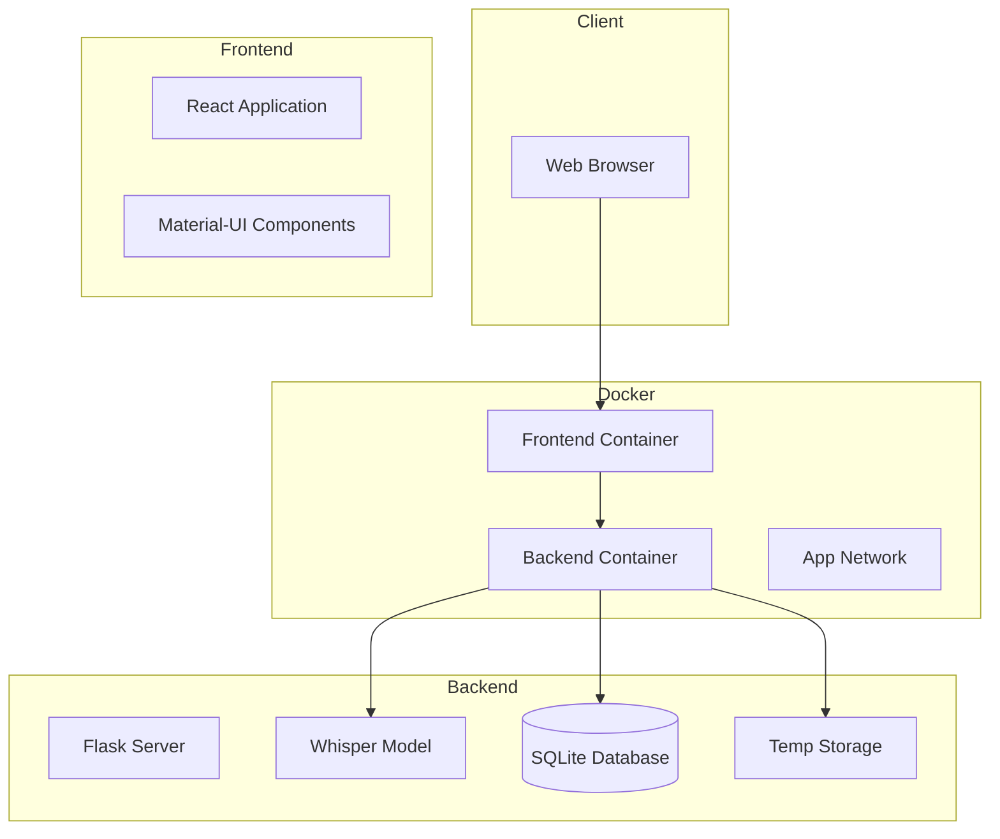

# HTX Scribe Architecture

## System Overview

## Component Details

### Frontend Layer
- **React Application**
  - Single Page Application
  - Material-UI for styling
  - Components:
    - FileUpload: Drag-and-drop interface
    - TranscriptionList: Display results
    - SearchBar: Real-time search
  - Environment: Node.js + Nginx

### Backend Layer
- **Flask Server**
  - RESTful API endpoints:
    - `/api/transcribe`: File upload & transcription
    - `/api/transcriptions`: List all transcriptions
    - `/api/search`: Search functionality
  - Swagger documentation
  - CORS enabled

- **Whisper Model**
  - Audio transcription
  - Model loaded on startup
  - Processes audio files

- **Storage**
  - SQLite Database:
    - Stores transcription results
    - Persistent volume
  - Temporary Storage:
    - Handles file uploads
    - Cleaned up after processing

### Infrastructure
- **Docker Containers**
  - Frontend Container:
    - Port: 80
    - Volume mounts for development
  - Backend Container:
    - Port: 5000
    - Volume mounts for data persistence
  - Network: Bridge network for container communication

### Data Flow
1. User uploads audio file through frontend
2. File sent to backend API
3. Backend processes file with Whisper
4. Results stored in SQLite
5. Frontend displays results
6. Search queries processed against database

### Security
- CORS configuration
- File type validation
- Input sanitization
- Secure file handling
- Error handling