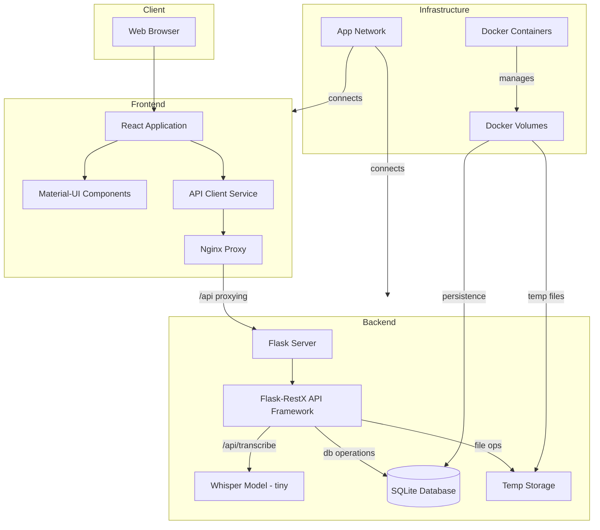

# HTX Scribe System Architecture

## Overview

HTX Scribe is a full-stack application for audio transcription using OpenAI's Whisper model. The system follows a containerized microservice architecture with clear separation between frontend and backend components.

## Architecture Diagram

## Component Details

### Frontend Layer
- **React Application**: Single page application with Material-UI
- **API Client**: Centralized service for backend communication
- **Nginx**: Static file serving and API proxying

### Backend Layer
- **Flask Server**: RESTful API with Flask-RestX
- **Whisper Model**: Audio transcription using "tiny" variant
- **Storage**: SQLite database and temporary file storage

### Infrastructure
- **Docker Containers**: Frontend and backend services
- **Docker Volumes**: For data persistence 